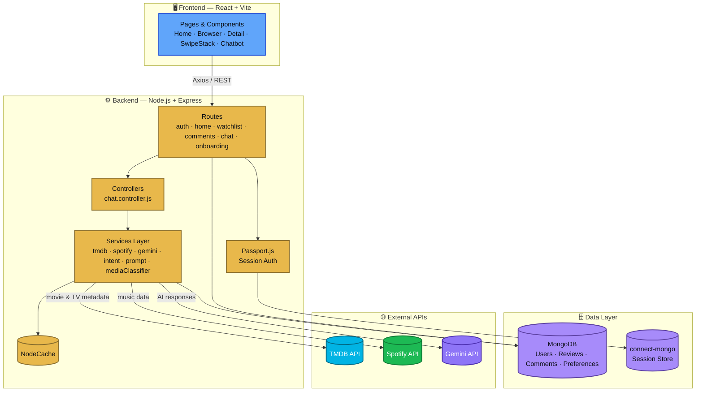
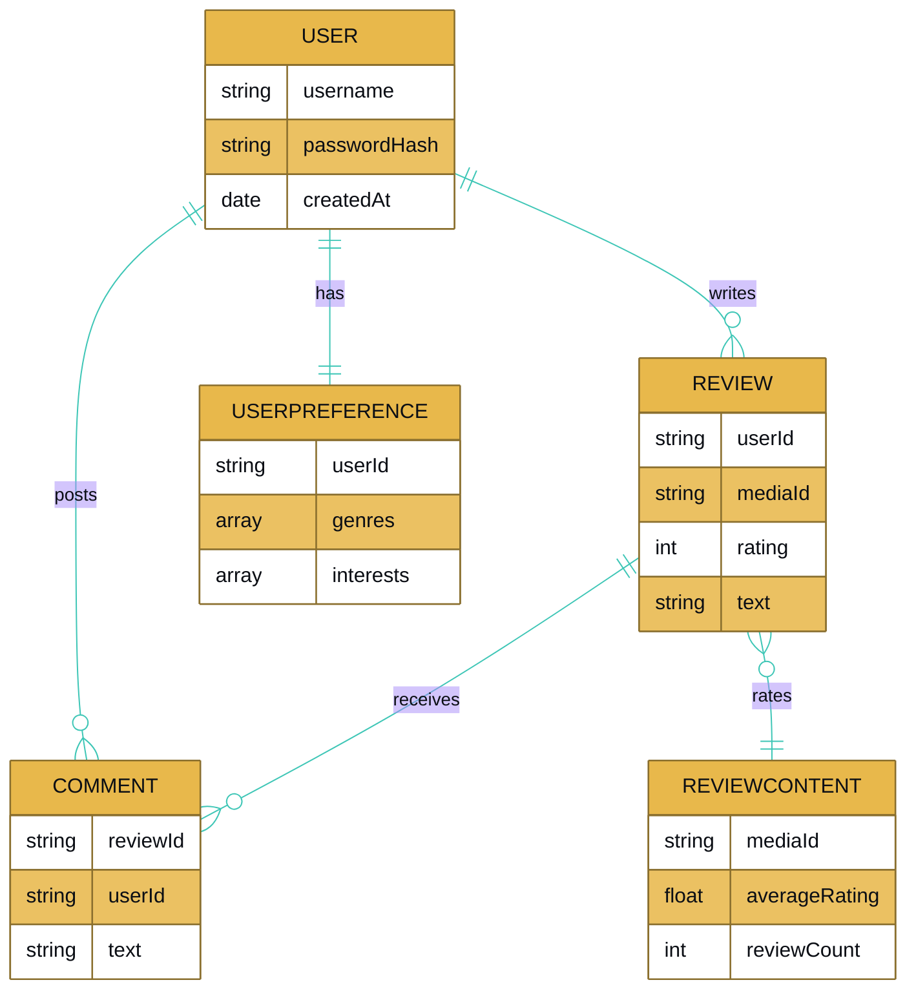
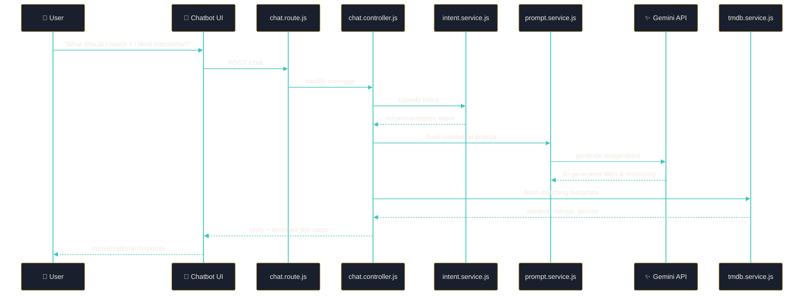

<div align="center">


**A premium, next-generation full-stack MERN media discovery and social interaction platform.**

[](#)
[](#)
[](#)
[](#)
[](#)
[](#)
[](#)
[](#)
[](#)

</div>

---

## 📖 Table of Contents

- [About](#-about)
- [Key Features](#-key-features)
- [Architecture](#-architecture)
- [Data Model](#-data-model)
- [AI Chatbot Flow](#-ai-chatbot-flow)
- [Screenshots](#-screenshots)
- [Tech Stack](#-tech-stack)
- [Project Structure](#-project-structure)
- [Getting Started](#-getting-started)

---

## 📌 About

**WatchVerse** is a modern entertainment hub enabling users to seamlessly discover movies and TV series, explore rich metadata, write interactive reviews, swipe through content recommendations, discuss in real-time chat rooms, and sing in a fully integrated Karaoke Studio. 

Powered by [The Movie Database (TMDB)](https://www.themoviedb.org/) and [Spotify Web API](https://developer.spotify.com/), WatchVerse blends high-fidelity media metadata with community-focused features and advanced Gemini AI assistants.

---

## ✨ Key Features

### 🎤 Karaoke Studio & Voice Recorder (NEW!)
Sing along to your favorite tracks directly inside the app:
- **Synced Lyrics Player**: Real-time scrolling and highlighting of transliterated (Romanized) lyrics for regional and Hindi tracks, making them accessible to read.
- **Auto-Play Backing Music**: Interactive HTML5 audio player and YouTube video integrations that trigger automatically when you start recording.
- **Web Audio API voice visualizer**: Smooth canvas visualizer showing real-time frequency waves of your voice.
- **Vocal Cover Mixer**: Automatically mixes your recorded microphone audio with the backing instrumental track, letting you preview your vocal cover inside the studio.
- **Community Submissions**: Save your covers directly to Cloudinary and share them in the Community Recordings catalog!

### 🤖 AI Entertainment Chatbot
Conversational media recommendations powered by the Gemini API:
- Ask natural-language questions like *"Recommend some thriller movies"* or *"Suggest good Hindi songs for karaoke"*.
- Understands search context and returns interactive movie/TV title cards.

### 🏠 Home Page
Browse curated, horizontally scrollable collections inspired by modern streaming platforms:
- Featured hero movie banner.
- Trending, popular & top-rated movies.
- Popular & top-rated TV series.
- Custom recommended feed.

### 🃏 Swipe-Based Discovery
A Tinder-style content discovery experience:
- Interactive swipe cards with fluid Framer Motion animations.
- Quick like/skip decisions to build recommendation algorithms.

### 🔐 User Authentication
- Secure registration and login with Passport.js.
- Secure password hashing using `bcrypt`.
- Persistent session storage in MongoDB using `connect-mongo`.

### 🔎 Browse & Search
- Smart lookup by title, actor, or creator.
- Filter by genre and media type.
- Duplicate result removal, sorted by rating, with smooth infinite scrolling.

### 🎞️ Content Detail Page
- Dedicated high-resolution posters & backdrops.
- Interactive cast list, creator metadata, and average community ratings.
- Watchlist management and user review statistics.

### ⭐ Reviews & Ratings
- 1–5 star ratings with written reviews (one review per user per title).
- Cached community average rating and comments thread on user reviews.

### 📝 Personal Watchlist
Track content across custom states:
- **Want to Watch** · **Watching** · **Watched**

### 💬 Chat Rooms
- Join real-time entertainment rooms to discuss suggestions with other users.

---

## 🏗️ Architecture

High-level view of how the frontend, backend, and external services fit together — colored by layer.



---

## 🗃️ Data Model

Core entities and how they relate, based on the Mongoose models in `Backend/Models/`.



---

## 🤖 AI Chatbot Flow

How a natural-language question turns into a recommendation.



---

## 📸 Screenshots

<div align="center">

| Home | Content Detail | Swipe Discovery |
|:---:|:---:|:---:|
|  |  |  |

| AI Chatbot | Watchlist | Chat Rooms |
|:---:|:---:|:---:|
|  |  |  |

</div>

---

## 🛠️ Tech Stack

<table>
<tr>
<td valign="top" width="33%">

**🖥️ Frontend**


</td>
<td valign="top" width="33%">

**⚙️ Backend**


`Express Session` · `connect-mongo` · `bcrypt` · `NodeCache` · `retry-axios`

</td>
<td valign="top" width="33%">

**🌐 External APIs**


</td>
</tr>
</table>

---

## 📁 Project Structure

```
WatchVerse/
│
├── Frontend/
│   ├── src/
│   │   ├── components/
│   │   │   ├── AnimatedOrb.jsx
│   │   │   ├── MediaAssistantChatbot.jsx
│   │   │   ├── Navbar.jsx
│   │   │   ├── ProgressBar.jsx
│   │   │   ├── ReviewComments.jsx
│   │   │   ├── SwipeCard.jsx
│   │   │   └── SwipeStack.jsx
│   │   │
│   │   ├── pages/
│   │   │   ├── Home.jsx
│   │   │   ├── Browser.jsx
│   │   │   ├── Detail.jsx
│   │   │   ├── Register.jsx
│   │   │   ├── onBoarding.jsx
│   │   │   └── Karaoke.jsx (New!)
│   │   │
│   │   ├── App.jsx
│   │   └── index.css
│   │
│   └── public/
│
├── Backend/
│   ├── Models/
│   │   ├── Comment.js
│   │   ├── Review.js
│   │   ├── User.js
│   │   ├── UserPreference.js
│   │   ├── reviewContent.js
│   │   └── KaraokeRecording.js (New!)
│   │
│   ├── controllers/
│   │   └── chat.controller.js
│   │
│   ├── routes/
│   │   ├── auth.route.js
│   │   ├── chat.route.js
│   │   ├── comments.route.js
│   │   ├── home.route.js
│   │   ├── onboarding.route.js
│   │   ├── watchlist.route.js
│   │   ├── karaoke.route.js (New!)
│   │   └── index.js
│   │
│   ├── services/
│   │   ├── gemini.service.js
│   │   ├── home.service.js
│   │   ├── intent.service.js
│   │   ├── mediaClassifier.service.js
│   │   ├── prompt.service.js
│   │   ├── spotify.service.js
│   │   ├── tmdb.service.js
│   │   └── lyrics.service.js (New!)
│   │
│   ├── config/
│   ├── lib/
│   └── server.js
│
├── package.json
├── package-lock.json
└── README.md
```

---

## 🚀 Getting Started

```bash
# Clone the repository
git clone https://github.com/shiva122019/WatchVerse.git
cd WatchVerse

# Install dependencies
cd Frontend && npm install
cd ../Backend && npm install

# Set up environment variables
# Add your TMDB, Spotify, Gemini, and MongoDB credentials to .env files

# Run the backend
cd Backend && npm start

# Run the frontend
cd Frontend && npm run dev
```

---

<div align="center">

Built with ❤️ using the **MERN** stack

</div>
