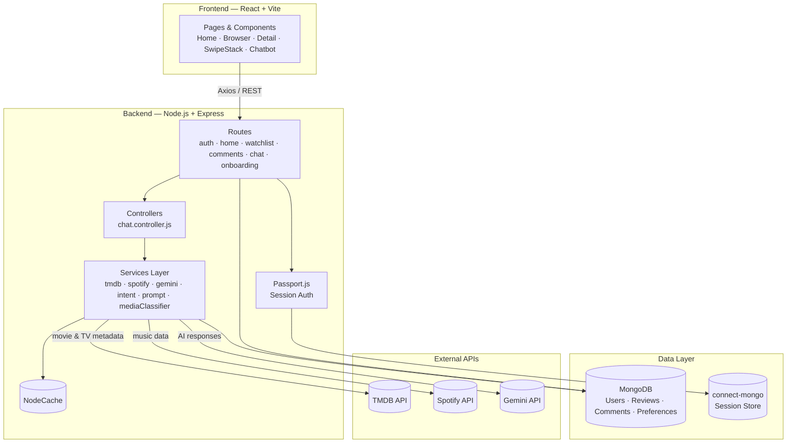
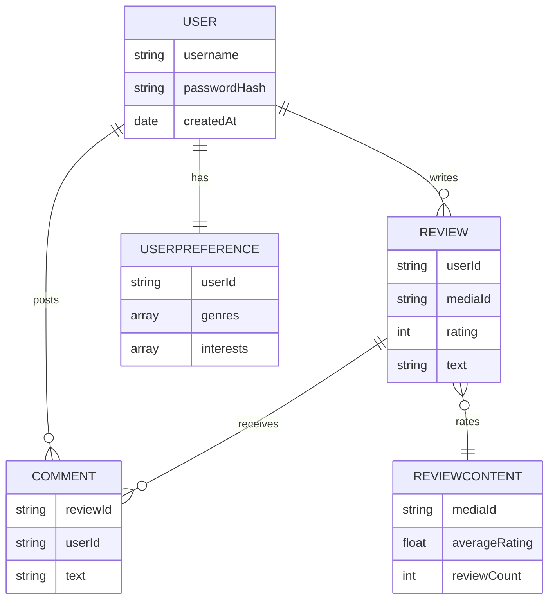
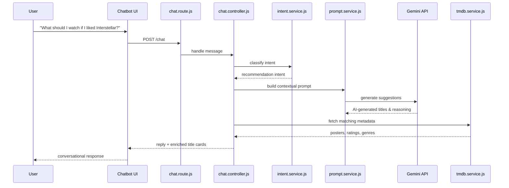

<div align="center">


**A full-stack MERN media discovery platform for movies, TV, music, and community.**

[](#)
[](#)
[](#)
[](#)
[](#)
[](#)

</div>

---

## 📖 Table of Contents

- [About](#-about)
- [Features](#-features)
- [Architecture](#-architecture)
- [Data Model](#-data-model)
- [AI Chatbot Flow](#-ai-chatbot-flow)
- [Screenshots](#-screenshots)
- [Tech Stack](#-tech-stack)
- [Project Structure](#-project-structure)
- [Getting Started](#-getting-started)

---

## 📌 About

**WatchVerse** enables users to discover movies and TV series, explore detailed information, write reviews, manage personalized watchlists, discover music, interact with AI, and connect with other users. Powered by [The Movie Database (TMDB)](https://www.themoviedb.org/), WatchVerse combines rich media metadata with personalized and social entertainment features.

---

## ✨ Features

### 🔐 User Authentication
- Secure registration and login
- Password hashing with `bcrypt`
- Session-based authentication using Passport.js
- Persistent login sessions via Express Session + MongoDB

### 🏠 Home Page
Browse curated, horizontally scrollable collections inspired by modern streaming platforms:
- Featured movie banner
- Trending, popular & top-rated movies
- Popular & top-rated TV series
- Curated content sections

### 🔎 Browse & Search
- Search by title, actor, or creator
- Filter by genre and media type
- Discover trending content and content by genre
- Duplicate result removal, sorted by rating
- Infinite scrolling

### 🎞️ Content Detail Page
Each title has a dedicated page with:
- High-resolution poster & backdrop
- Description, genres, release year
- Runtime or season count
- Director/creator and main cast
- Average community rating & review count
- User reviews and watchlist controls

### ⭐ Reviews & Ratings
- 1–5 star ratings with written reviews
- One review per user per title
- Cached community average rating
- Reverse-chronological review feed
- Comments on reviews

### 📝 Personal Watchlist
Track content across custom states:
- **Want to Watch**
- **Watching**
- **Watched**

Add, update status, remove, and view all saved titles.

### 🃏 Swipe-Based Discovery
A Tinder-style content discovery experience:
- Interactive swipe cards
- Quick like/skip decisions
- Smooth card animations
- Personalized discovery experience

### 🤖 AI Entertainment Chatbot
Ask natural-language questions like:
> *"Recommend some thriller movies"*
> *"What should I watch if I liked Interstellar?"*
> *"Suggest some good comedy series"*

Powered by the Gemini API for conversational content discovery.

### 💬 Chat Rooms
- Join entertainment discussions
- Share recommendations and exchange opinions
- Interact with other users in real time

### 🎵 Music Discovery
Powered by Spotify integration:
- Explore songs, artists, and albums
- Get music recommendations
- Extends WatchVerse beyond movies & TV

### 🎯 User Preferences & Personalization
- Genre and interest preferences
- Personalized discovery and recommendations
- User-specific content tuning

### ♾️ Infinite Scrolling
Continuous content discovery without pagination — smoother browsing and better exploration.

---

## 🏗️ Architecture

High-level view of how the frontend, backend, and external services fit together.



---

## 🗃️ Data Model

Core entities and how they relate, based on the Mongoose models in `Backend/Models/`.



---

## 🤖 AI Chatbot Flow

How a natural-language question turns into a recommendation.



---

## 📸 Screenshots

> Add real screenshots or a screen recording here — this section is a placeholder layout to drop them into.

<div align="center">

| Home | Content Detail | Swipe Discovery |
|:---:|:---:|:---:|
|  |  |  |

| AI Chatbot | Watchlist | Chat Rooms |
|:---:|:---:|:---:|
|  |  |  |

</div>

To use these: create a `screenshots/` folder in the repo root, drop in your PNGs with the matching filenames above (or update the paths), and they'll render automatically on GitHub.

---

## 🛠️ Tech Stack

<table>
<tr>
<td valign="top" width="33%">

**Frontend**
- React
- Vite
- React Router
- Axios
- Tailwind CSS
- Framer Motion

</td>
<td valign="top" width="33%">

**Backend**
- Node.js
- Express.js
- MongoDB
- Mongoose
- Passport.js
- Express Session
- connect-mongo
- bcrypt
- NodeCache
- retry-axios

</td>
<td valign="top" width="33%">

**External APIs**
- TMDB (The Movie Database)
- Spotify API
- Gemini API

</td>
</tr>
</table>

---

## 📁 Project Structure

```
WatchVerse/
│
├── Frontend/
│   ├── src/
│   │   ├── components/
│   │   │   ├── AnimatedOrb.jsx
│   │   │   ├── MediaAssistantChatbot.jsx
│   │   │   ├── Navbar.jsx
│   │   │   ├── ProgressBar.jsx
│   │   │   ├── ReviewComments.jsx
│   │   │   ├── SwipeCard.jsx
│   │   │   └── SwipeStack.jsx
│   │   │
│   │   ├── pages/
│   │   │   ├── Home.jsx
│   │   │   ├── Browser.jsx
│   │   │   ├── Detail.jsx
│   │   │   ├── Register.jsx
│   │   │   └── onBoarding.jsx
│   │   │
│   │   ├── App.jsx
│   │   └── index.css
│   │
│   └── public/
│
├── Backend/
│   ├── Models/
│   │   ├── Comment.js
│   │   ├── Review.js
│   │   ├── User.js
│   │   ├── UserPreference.js
│   │   └── reviewContent.js
│   │
│   ├── controllers/
│   │   └── chat.controller.js
│   │
│   ├── routes/
│   │   ├── auth.route.js
│   │   ├── chat.route.js
│   │   ├── comments.route.js
│   │   ├── home.route.js
│   │   ├── onboarding.route.js
│   │   ├── watchlist.route.js
│   │   └── index.js
│   │
│   ├── services/
│   │   ├── gemini.service.js
│   │   ├── home.service.js
│   │   ├── intent.service.js
│   │   ├── mediaClassifier.service.js
│   │   ├── prompt.service.js
│   │   ├── spotify.service.js
│   │   └── tmdb.service.js
│   │
│   ├── config/
│   ├── lib/
│   └── server.js
│
├── package.json
├── package-lock.json
└── README.md
```

---

## 🚀 Getting Started

```bash
# Clone the repository
git clone https://github.com/your-username/WatchVerse.git
cd WatchVerse

# Install dependencies
cd Frontend && npm install
cd ../Backend && npm install

# Set up environment variables
# Add your TMDB, Spotify, Gemini, and MongoDB credentials to .env files

# Run the backend
cd Backend && npm start

# Run the frontend
cd Frontend && npm run dev
```

---

<div align="center">

Built with ❤️ using the **MERN** stack

</div>
